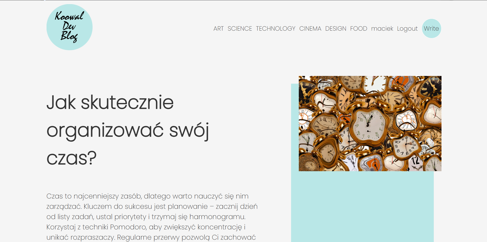

# Full Stack Blog Application

A modern full-stack blog application built with React.js for the frontend and Node.js/Express for the backend. This application allows users to create, read, update, and delete blog posts, with user authentication and category filtering.



## Features

- **User Authentication**: Register, login, and logout functionality
- **Blog Post Management**: Create, edit, and delete posts
- **Rich Text Editing**: Format blog content with React Quill
- **Category Filtering**: Filter posts by categories (Art, Science, Technology, etc.)
- **Responsive Design**: Mobile-friendly interface
- **Image Uploads**: Upload images for blog posts using ImageKit CDN
- **User Authorization**: Only post authors can edit/delete their content

## Tech Stack

### Frontend
- **React.js**: UI library
- **React Router**: Navigation and routing
- **Axios**: API requests
- **React Quill**: Rich text editor
- **Sass**: Styling
- **Moment.js**: Date formatting
- **ImageKit React**: Image hosting and optimization

### Backend
- **Node.js**: JavaScript runtime
- **Express**: Web framework
- **MySQL**: Database
- **JWT**: Authentication
- **Bcrypt**: Password hashing
- **Multer**: File uploads
- **ImageKit**: Image storage and CDN
- **CORS**: Cross-Origin Resource Sharing

## Project Structure

### Frontend
```
Frontend/
├── src/
│   ├── Components/     # Reusable components
│   ├── Context/        # Auth context for state management
│   ├── Pages/          # Page components
│   ├── Utility/        # Utility functions
│   ├── img/            # Static images
│   ├── App.jsx         # Main component with routing
│   └── style.scss      # Global styles
```

### Backend
```
Backend/
├── controllers/        # Request handlers
├── routes/             # API routes
├── db.js               # Database connection
└── index.js            # Server entry point
```

## Setup Instructions

### Prerequisites
- Node.js (v14+)
- MySQL
- ImageKit account (for image uploads)

### Environment Variables

#### Frontend (.env)
```
VITE_API_URL=http://localhost:3000
VITE_URL_IK_ENDPOINT=https://ik.imagekit.io/your-imagekit-id/
```

#### Backend (.env)
```
DB_HOST=localhost
DB_USER=your_db_user
DB_PASS=your_db_password
DB_DB=blog_db
DB_PORT=3306
JWT_SECRET=your_jwt_secret
CLIENT_URL=http://localhost:5173
PORT=3000
IMAGEKIT_PUBLIC_KEY=your_imagekit_public_key
IMAGEKIT_PRIVATE_KEY=your_imagekit_private_key
IMAGEKIT_URL_ENDPOINT=https://ik.imagekit.io/your-imagekit-id/
```

### Database Setup

Create a MySQL database with the following tables:

```sql
CREATE TABLE users (
  id INT AUTO_INCREMENT PRIMARY KEY,
  username VARCHAR(255) NOT NULL UNIQUE,
  email VARCHAR(255) NOT NULL UNIQUE,
  password VARCHAR(255) NOT NULL,
  img VARCHAR(255)
);

CREATE TABLE posts (
  id INT AUTO_INCREMENT PRIMARY KEY,
  title VARCHAR(255) NOT NULL,
  `desc` TEXT NOT NULL,
  img VARCHAR(255),
  date DATETIME NOT NULL,
  uid INT NOT NULL,
  category VARCHAR(50),
  FOREIGN KEY (uid) REFERENCES users(id)
);
```

### Installation

1. **Clone the repository**
   ```
   git clone <repository-url>
   ```

2. **Backend Setup**
   ```
   cd Backend
   npm install
   npm start
   ```
   
3. **Frontend Setup**
   ```
   cd Frontend
   npm install
   npm run dev
   ```

## Usage

1. **Register a new user** at `/register`
2. **Login** at `/login`
3. **Create a new post** by clicking on the "Write" button
4. **View posts** on the home page, filter by category using the navigation links
5. **Edit/Delete your posts** from the single post view

## API Routes

### Auth Routes
- `POST /api/auth/register` - Register a new user
- `POST /api/auth/login` - Login user
- `POST /api/auth/logout` - Logout user

### Posts Routes
- `GET /api/posts` - Get all posts
- `GET /api/posts?category=science` - Get posts by category
- `GET /api/posts/:id` - Get a specific post
- `POST /api/posts` - Create a new post
- `PUT /api/posts/:id` - Update a post
- `DELETE /api/posts/:id` - Delete a post

### Upload Route
- `POST /api/upload` - Upload an image to ImageKit

## Deployment

The application can be deployed using platforms like:
- **Frontend**: Vercel, Netlify, or Render
- **Backend**: Render, Heroku, or Railway
- **Database**: Managed MySQL services like AWS RDS or PlanetScale

## Contributing

1. Fork the repository
2. Create your feature branch (`git checkout -b feature/amazing-feature`)
3. Commit your changes (`git commit -m 'Add some amazing feature'`)
4. Push to the branch (`git push origin feature/amazing-feature`)
5. Open a Pull Request

## License

This project is licensed under the MIT License - see the LICENSE file for details.